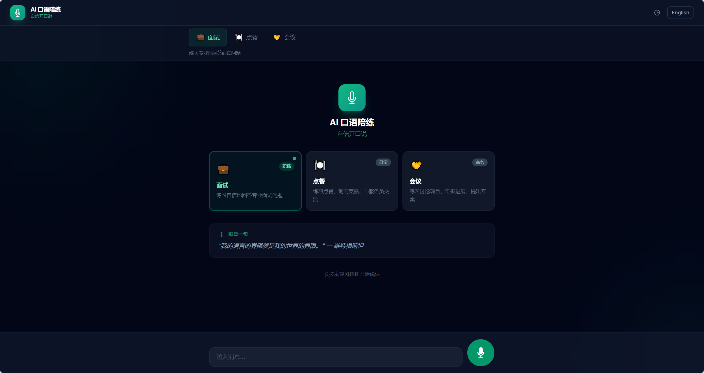
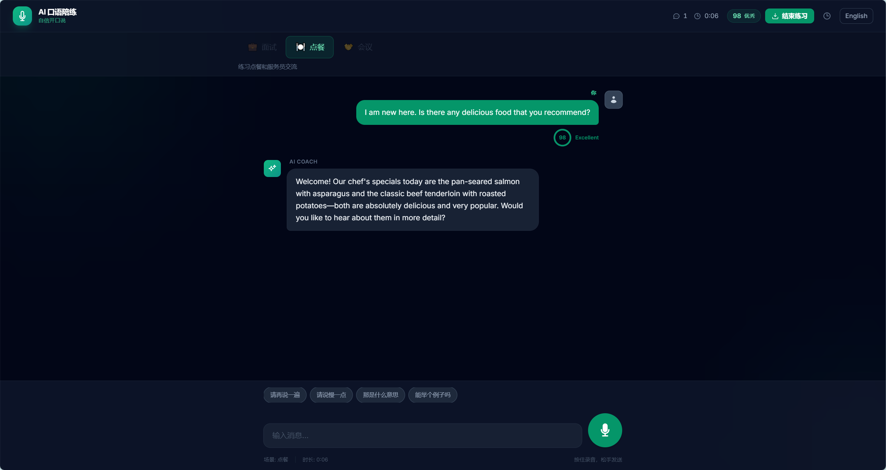
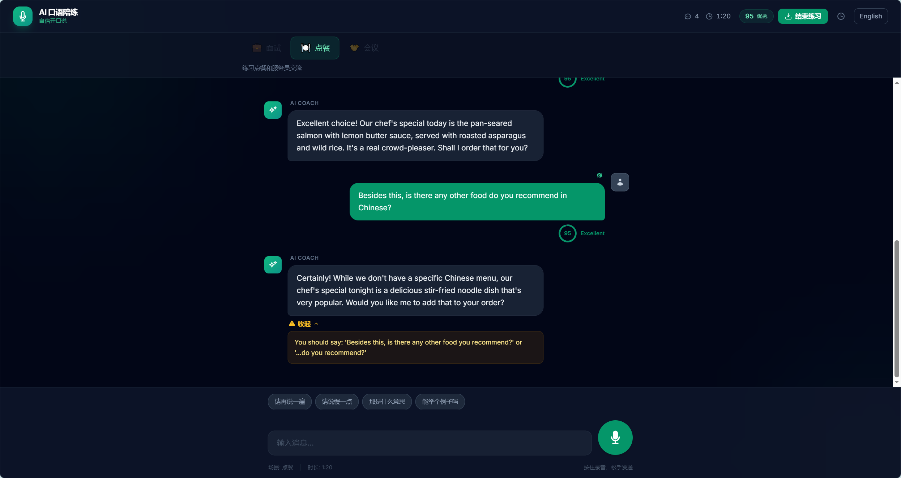
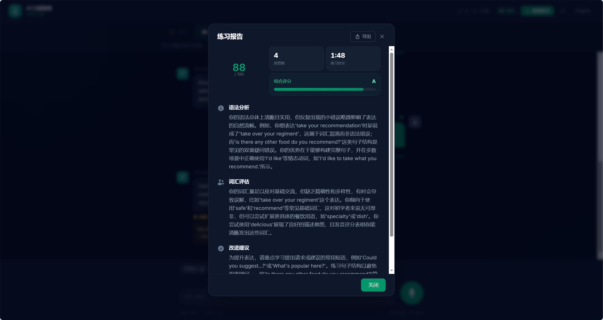

# AI Speaking Practice

> AI 驱动的英语口语陪练工具，通过实时语音对话帮助你自信开口说英语。

## 功能亮点

- **实时语音对话** — 按住说话，AI 即时回应，模拟真实对话节奏
- **多场景切换** — 面试、点餐、商务会议三大场景，覆盖职场与日常生活
- **AI 语法纠错** — 每轮对话自动检测语法问题，点击展开详细解释
- **发音评分** — 基于语音识别置信度实时打分，追踪练习进步
- **课后总结报告** — 结束练习后生成综合评分、语法分析、词汇评估与改进建议
- **中英双语界面** — 一键切换 UI 语言，报告内容自动翻译
- **练习历史** — 本地保存每次练习记录，随时回顾进步轨迹

## 技术栈

| 层级 | 技术 |
|------|------|
| 前端框架 | Next.js 14 (App Router) + TypeScript |
| 样式 | Tailwind CSS |
| 状态管理 | Zustand |
| 后端框架 | Python FastAPI |
| 语音识别 | OpenAI Whisper (via MiMo Proxy) |
| 对话 AI | GPT-4o (via MiMo Proxy) |
| 语音合成 | Web Speech API (browser-native) |

## 项目结构

```
ai-speaking-app/
├── frontend/               # Next.js 前端
│   ├── app/
│   │   ├── page.tsx        # 主页面
│   │   ├── layout.tsx      # 根布局
│   │   ├── globals.css     # 全局样式 + 动画
│   │   └── components/
│   │       ├── AudioRecorder.tsx   # 录音组件
│   │       ├── ScoreBadge.tsx      # 分数徽章
│   │       ├── SummaryModal.tsx    # 报告弹窗
│   │       └── Sidebar.tsx         # 历史侧边栏
│   └── lib/
│       ├── i18n.ts         # 国际化字典
│       ├── useAppStore.ts  # Zustand 全局状态
│       └── useAudioRecorder.ts  # 录音 Hook
├── backend/                # FastAPI 后端
│   ├── main.py             # 入口 + CORS
│   └── routers/
│       ├── chat.py         # 对话接口
│       ├── transcribe.py   # 语音转文字
│       └── summary.py      # 总结报告生成
├── PRODUCT.md              # 产品定位文档
└── DESIGN.md               # 设计规范文档
```

## 本地启动指南

### 前置要求

- Node.js >= 18
- Python >= 3.10
- 有效的 MiMo Proxy API Key

### 1. 克隆仓库

```bash
git clone https://github.com/your-username/ai-speaking-app.git
cd ai-speaking-app
```

### 2. 启动后端

```bash
cd backend

# 创建虚拟环境
python -m venv venv
# Windows
venv\Scripts\activate
# macOS / Linux
source venv/bin/activate

# 安装依赖
pip install -r requirements.txt

# 配置环境变量
# 创建 .env 文件，写入：
# MIMO_API_KEY=your_api_key_here
# MIMO_BASE_URL=https://api.mimo.ai/v1

# 启动服务
uvicorn main:app --host 0.0.0.0 --port 8001 --reload
```

### 3. 启动前端

```bash
cd frontend

# 安装依赖
npm install

# 配置环境变量
# 创建 .env.local 文件，写入：
# NEXT_PUBLIC_API_URL=http://localhost:8001

# 启动开发服务器
npm run dev
```

### 4. 访问应用

打开浏览器访问 [http://localhost:3000](http://localhost:3000)

## 演示视频

https://github.com/Zoro-Luoluonuoya/AI-speaking-app/raw/main/docs/screenshots/demo.mp4

<video src="https://github.com/Zoro-Luoluonuoya/AI-speaking-app/raw/main/docs/screenshots/demo.mp4" controls width="100%"></video>

## 项目截图

### 首页 — 场景选择



### 对话页 — 实时语音交流



### 语法纠错



### 总结报告



## API 接口

| 方法 | 路径 | 说明 |
|------|------|------|
| POST | `/api/transcribe` | 语音转文字 |
| POST | `/api/chat/send` | 发送对话消息 |
| POST | `/api/summary/generate` | 生成练习报告 |

## License

MIT
